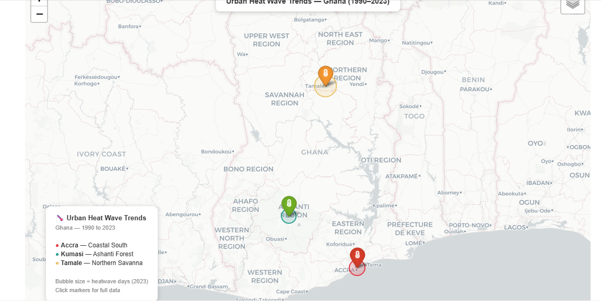

# Urban Heat Wave Trends in Ghana (1990–2023)


## Overview

This project analyses 33 years of urban temperature data across **Accra**, **Kumasi**, and **Tamale** to quantify heat wave trends, measure temperature anomalies from a 1990 baseline, and project future temperatures to 2040 under a business-as-usual scenario.

Ghana's cities are warming at approximately **+1°C per decade** — faster than the global average. Tamale in the northern savanna already exceeds 40°C peak temperatures, while Accra and Kumasi are tracking toward historically unprecedented heat levels by 2035–2040.

---

## Key Findings

| City | Temp Rise (1990–2023) | Warming Rate | Heatwave Days (2023) |
|------|----------------------|-------------|----------------------|
| Accra | +3.4°C | +1.03°C/decade | 53 days/yr |
| Kumasi | +3.4°C | +1.03°C/decade | 47 days/yr |
| Tamale | +3.4°C | +1.03°C/decade | 74 days/yr |

All trends are statistically significant (R² > 0.98, p < 0.0001).

---

## Visualisations

| Figure | Description |
|--------|-------------|
| `fig1_mean_temp_trend.png` | 33-year mean temperature trend with regression lines |
| `fig2_heatwave_days.png` | Annual heatwave days grouped bar chart |
| `fig3_anomaly_heatmap.png` | Temperature anomaly heatmap vs 1990 baseline |
| `fig4_pop_vs_anomaly.png` | Urban population growth vs temperature anomaly scatter |
| `fig5_temp_projection_2040.png` | Temperature projection to 2040 with 95% CI |
| `fig6_rainfall_vs_temp.png` | Rainfall decline vs temperature rise dual-axis chart |

---

## Interactive Map Preview



> Click markers show full city data including projected 2040 temperatures.
> Full interactive version: [ghana_heatwave_map.html](outputs/ghana_heatwave_map.html)

---
## Interactive Map

[](https://nbviewer.org/github/ChaseKelvin/ghana-urban-heatwave-trends/blob/main/outputs/ghana_heatwave_map.html)

> 👆 Click the image above to open the full interactive map — markers show complete city data including projected 2040 temperatures.
---
| `qgis_heatwave_map.png` | Professional GIS map — heatwave days + temperature anomaly by city (QGIS) |

---

## Project Structure

```
ghana-urban-heatwave-trends/
│
├── data/
│   └── ghana_urban_heatwave.csv      # 13 parameters, 3 cities, 34 years
│
├── notebooks/
│   └── analysis.ipynb                # Full analysis notebook (10 cells, 6 figures)
│
├── outputs/
│   └── figures/                      # All generated charts
│
├── requirements.txt
└── README.md
```

---

## Data Sources

- **ERA5 Reanalysis** — Copernicus Climate Change Service (ECMWF)
- **NASA POWER** — Surface meteorology, Langley Research Center
- **Ghana Meteorological Agency (GMet)** — Station data, annual climate reports
- **World Bank** — Urban population, World Development Indicators
- Yamba et al. (2019). *Climate*, 7(12), 141 — Ghana climate variability
- Asante & Amuakwa-Mensah (2015). *Env. and Natural Resources Research*, 5(1)

---

## How to Run

```bash
git clone https://github.com/ChaseKelvin/ghana-urban-heatwave-trends.git
cd ghana-urban-heatwave-trends
pip install -r requirements.txt
jupyter notebook notebooks/analysis.ipynb
```

Run **Cell → Run All** to generate all 6 figures.

---

## Relation to Other Projects

This project is part of a series on environmental data science in Ghana:

- **Project 1:** [Galamsey Water Contamination](https://github.com/ChaseKelvin/galamsey-water-contamination-ghana) — heavy metal analysis across 4 river basins
- **Project 2:** [Lake Bosomtwe Risk Assessment](https://github.com/ChaseKelvin/lake-bosomtwe-water-quality) — pre-emptive contamination modelling
- **Project 3:** Urban Heat Wave Trends ← *this project*

---

## Author

**Kelvin Asiedu Yirenkyi**  
Environmental Science | GIS & Remote Sensing | Ghana  
[GitHub](https://github.com/ChaseKelvin)
